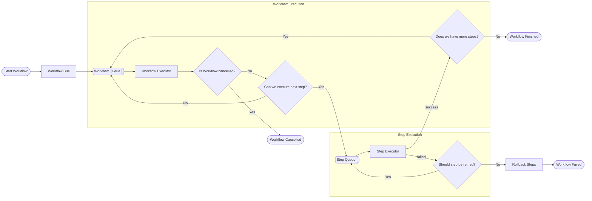
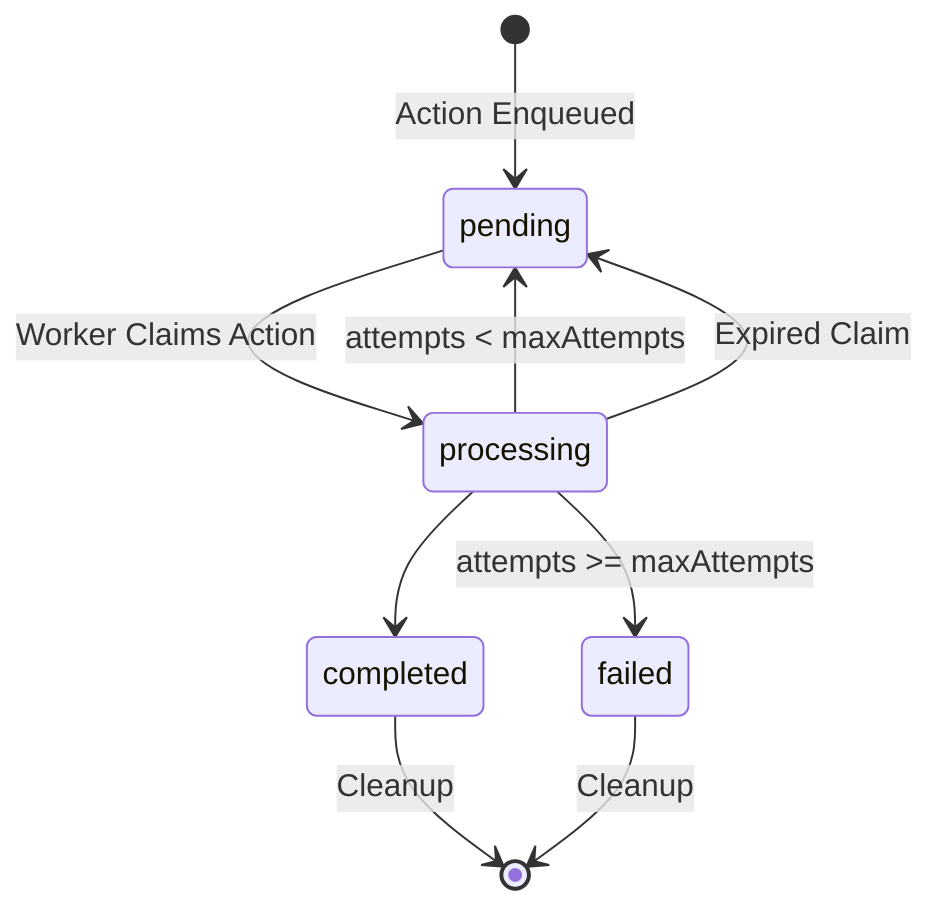
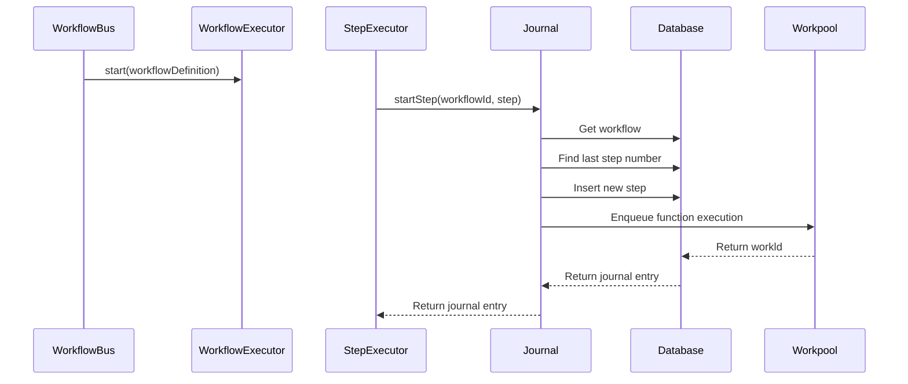

# Summary

We need to evolve our existing workflow system to support long-running, resilient operations that can survive server restarts, handle retries, and execute asynchronously over extended time periods (minutes to days). This RFC proposes adding durability capabilities to workflows through a step-based execution model with conditional execution and retry/rollback mechanisms.

# Context and Problem Statement

Our current workflow implementation has proven valuable for the AI initiative, allowing us to orchestrate complex operations involving command bus, query bus, and AI dependencies. However, we're hitting critical limitations:

### Current Constraints:

- Workflows are constrained by 60-second timeout limits (standard server/browser timeouts)
- All operations must complete synchronously within a single request lifecycle
- Workflows cannot survive server restarts
- No built-in retry or rollback mechanisms

### Why This Matters Now:

1. **AI Latency**: AI operations can take minutes depending on system design, far exceeding our current timeframe
2. **Product Requirements**: Features requiring >1 minute are considered background jobs. While we've kept current features within ~30 seconds, longer durations are not acceptable for interactive functionality without a better solution
3. **Upcoming Features**: New requirements like classroom/assignment insights will run entirely in the background
4. **Streaming Limitations**: While streaming could mitigate some latency issues, not all features fit the streaming experience model

### Goals:

- Enable workflows to run for extended periods (minutes to days) without penalties
- Survive server restarts (resilient)
- Support retry and rollback mechanisms (consistent/idempotent)
- Allow programmatic status checking to build rich UIs while its processing
- Maintain or improve current developer experience

### Constraints:

- Must integrate with existing workflow system
- Should work with current command/query bus architecture
- Need to preserve existing “synchronous” workflow capabilities for features that require them

# Proposed Solution

## What do we mean by "Durable Workflows"?

In durable workflows we group a bunch of qualities, those are:

- ***Resilient*** It should survive server restarts
- ***Consistent*** It should be able to retry steps or rollback them. Idempotent.
- ***Durable*** It should be able to run for a long time without penalization
- ***Know in which state is in*** We should be able to programmatically check what is the status

## Problem space

We will divide the proposal into two: first, we will dive into code ergonomics and step modeling, and then the technical system solution.

It’s important to start with code ergonomics to ensure we have the best DX possible and that it is cohesive with the rest of the system, code-wise. This does not mean that the technical system solution won’t influence the final code ergonomics, but it’s better to have an ideal in mind to not stray too far from it.

Within the technical system solution, we have identified two problems to solve:

1. How to reliably execute actions
2. How to chain executions of actions

Another problem to be aware of is the idempotency of our code. Right now we already think about it, but its effect is more contained to only event handlers. With the introduction of durable workflows, we have to think about idempotency on every command, since it could be potentially used in a durable workflow.

## Code Ergonomics

### Step definition

As a first thing to decide, we should define the "frontiers" of what to consider as a step. To do so we have two options:

- Introduce a new injected dependency on the workflows called `step`
- Consider everything put on the buses injected is a step in itself (ie. sending a command is a step)

The election is nuanced, since the first option adds an extraneous dependency we didn't have before, but at the same time broadens the definition of step to potentially include anything async, instead of the current building blocks of query and command.

Our proposal is to have a step due to the advantage of include anything async inside the definition of what is a step and have flexibility with extra features like scheduling, retries, rollbacks, etc.

### Durability definition

The second big thing is to define who "says" a workflow is durable. Here we have multiple options:

- The one that runs the workflow decides to launch it synchronously or durably
- The own workflow definition includes this

Our proposal here is to treat all workflows executions as durable, and just offer “syntactic sugar” to the consumer of the workflow to be able to wait for its completion.

### Conditional steps

This means how we handle the definition of what condition to follow to decide if a step has to be executed or not. Here we have two main solutions:

```jsx
// Option 1 - One function configurable using options
const result = step.run(
  fn,
  // Option 1
  {
    condition: wait("5m"),
  }
);

const result = step.run(
  fn,
  // Option 1
  {
    condition: waitForEvent({
      event: "content.quiz.1.event.quiz_created",
      timeout: "3d",
      matchField: "attributes.userId",
      matchData: userId,
    }),
  }
);

// Option 2 - One function for each need

step.waitFor("5m");

const result = step.run(fn);

step.waitForEvent({
  event: "content.quiz.1.event.quiz_created",
  timeout: "3d",
  matchField: "attributes.userId",
  matchData: userId,
});

const result = step.run(fn);
```

<aside>
💬

**[RFC]** We are currently leaning towards expressing things using multiple functions within the step dependency instead of trying to configure everything on a single function. It gives more readability for the developers using it and more flexibility for us designing the system.

Another pro of having specialized functions is that it’s easier to create human-in-the-loop flows in AI. For example, we could easily create a `step.waitForUserConfirmation()` and put it on the workflow where we want to wait for the user’s approval.

</aside>

### Retry definition

We have to define a way to configure the retry logic for each step in case of failure. The easiest way to do so would be to apply the same retry logic to all steps. For example, 5 retries with exponential backoff starting at 1 minute.

A possible override definition in code could be the following

```jsx
step.run(fn, {
  retryBehaviour: {
    // Configures the backoff time -> initialBackoffMs * (base ^ attemptNumber)
    maxAttempts: 3,
    initialBackoffMs: 1000,
    base: 2,
  },
});
```

If steps are meant to be retried by default, we should think about how to prevent further retries. For example, imagine that the step fails because the user no longer exists. In that case, we know for a fact that we should fail the workflow being executed and that no further retries are necessary of the current step. Since the retry logic is tied of errors being thrown inside the step, the easiest way to implement this would be to add a custom error to not do further retries, like for example a custom error called `NonRetriableError` .  We could hide this inside a function on the injected step. For example

```jsx
step.run(() => {
  try {
    // Some logic
  } catch (error) {
    if (error === "user-does-not-exist") {
      // Internally it would do something like `throw new NoneRetriableError`
      step.dontRetry(); // or .nonRetriableStep()
    }
  }
});
```

Another feature that we think would be useful but a nice to have, is to be able to configure the backoff time inside the step failure. For example, think about a third party service that we hit the rate limit. Usually, those 3rd parties tell us when the rate limit window ends and we can start doing again requests. We could have something like:

```jsx
step.run(() => {
  try {
    // Some logic
  } catch (error) {
    if (error === "rate-limit") {
      // Internally it would do something like `throw new RetryAfterError`
      step.retryAfter(error.retryAfter);
    }
  }
});
```

<aside>
💬

**[RFC]** Should the workflow itself be able to define its own custom retry behavior to apply to all steps? It’s a nice to have?

</aside>

### Rollback definition

Rollbacks of a step should be optional since we could have steps that do not need to be rolled back. We could take advantage of the options object we introduced with the retry definition and add there a new `rollback` field. For example:

```jsx
step.run(fn, {
  retryBehaviour: {
    maxAttempts: 3,
    initialBackoffMs: 1000,
    base: 2,
  },
  rollback: () => {
    // rollback code
  },
});
```

The rollback function will be treated as a step.

<aside>
💬

**[RFC]** Should rollbacks have the same retry behavior as the step itself?

</aside>

### Flow Control

As the last point to define on our code ergonomics around Durable Workflows is what kind of flow control we want to give the developer. With flow control, we refer to:

- Conditional branches
- Parallel executions
- Loops over steps
- Cancellation

**Conditional Branches**

We should be able to include conditional step execution in the code itself. For example, this should be a valid workflow definition:

```jsx
function someWorkflowHandler(workflow, { step }) {
  if (workflow.getAttributes().shouldExecuteA) {
    step.run(() => {
      // A branch
    });
  } else {
    step.run(() => {
      // B branch
    });
  }
}
```

**Parallel Executions**

We should be able to let the workflow execute steps in parallel. For example, this should be a valid workflow definition:

```jsx
function someWorkflowHandler(workflow, { step }) {
  const results = Promise.all([
    step.run(() => {
      // ...
    }),
    step.run(() => {
      // ...
    }),
  ]);

  return results;
}
```

**Loops Over Steps**

We should be able to let the workflow loop over step executions. For example, this should be a valid workflow definition:

```jsx
function someWorkflowHandler(workflow, { step }) {
  const results = sequence(workflow.getAttributes().ids, (id) =>
    step.run(() => {
      // Logic for that id
    })
  );

  return results;
}
```

**Cancellation**

We should be able to cancel a workflow that is running right now. Each workflow has an ID, so we should define a way of canceling a workflow for a given ID. This is related to how to check the status of a workflow, so we will discuss it in its own section.

<aside>
💬

**[RFC]** Any missing control flow case?

</aside>

### Status Management

After defining the code ergonomics of the durable workflows themselves, the last piece of the puzzle missing is how external code can:

- Know the status of the workflow
- Know the result of the workflow
- Start a workflow
- Cancel a running workflow

Our proposal hinges around giving 2 complementary ways of accessing it:

- Use the `workflowBus` to include all these functionalities
- A new router to let the FE get that information using the `workflowBus` internally

For example, we could have:

```jsx
// Workflow Bus Methods

// Would return the workflow status, result, individual step status, etc.
const workflowInformation = workflowBus.getWorkflowInformation({ workflowId })

// Remove the handle function to differentiate waiting for the result or not
const { workflowId } = workflowBus.start(/* ... */)
// This will only do a "wait" inside checking the workflow status with a long polling
const workflowInformation = workflowBus.startSync(/* ... */)

workflowBus.cancel({ workflowId })

// Workflow Router
GET /api/v3/workflow/:workflowId // -> calls workflowBus.getWorkflowInformation
DELETE /api/v3/workflow/:workflowId // -> calls workflowBus.cancel
```

## Technical Implementation

When thinking about the implementation of this system, a general simplified flow like this could come to mind:



The flow describes putting the workflow into its own execution queue, then executing the steps one by one using another queue for steps until we either have completed all steps, the workflow is canceled, or there is a non-recoverable workflow failure. Here we can clearly see that we have two separate concerns that we could design separately and could be composed in the end. These parts are:

1. Reliable action executions
    - This is present on both the step execution with the retry logic and the workflow execution itself, which decides if we need to execute more steps or not. Both of these cases are actions that we have to make sure are executed.
    - It serves as a very basic building block that could be even used for other features like async command execution
2. Durable state machine
    - We need to both keep track of the execution status and have complex logic about what step to execute and how.
    - This translates to the need of having a state machine with logic associated to state transitions.

## Reliable action executions

The objective of this system is to offer a generic way of executing any action with guarantees and configuration around retriability. This should serve as the building block to execute steps and workflows. It could be expanded to other uses like asynchronous command execution, or even the current event handling system, although this last one would need an extra layer on top to handle the 1-to-N nature of the problem.

### Previous Work

Around this problem, we have a current implementation that tries to solve a similar problem. Its the event bus in infrastructure. As a summary, this system consists on three different parts:

1. Event Publishing
2. EventBridge + SQS as infrastructure bus
3. SQS Consumer + In-Memory Event Handling

The event publishing refers to the mechanisms we currently have to publish events on our domain. We inject an event bus on the commands we have on our application layer. There, the use cases can call the `publish` method of the event bus defining the publisher to use, having three options: `sync in memory`, `async in memory` and `infrastructure`. When picking the last option, its where the bus publishes the event to EventBridge. If EventBridge is disable (for example in localhost) it will be handled as if the use case defined the `async in memory` option

On the infrastructure side, we have an EventBridge that serves as the bus where all events are published. There, with rules about the type of event, they are put on a specific SQS queue. All events from our domain go through that queue to be processed.

Lastly, we have an SQS Consumer on our server entry points. That consumer polls the queue, gets the event from the queue message, and handles it in memory with the event bus we have, behaving like the `async in memory` option. Here, we have an idempotency layer that ensures that an event with a given ID is only handled once for a given module.

Two things to note in this case:

- SQS acts with the `at-least-once` mode instead of `just-once` hence the need of an idempotency layer. This can’t be configured
- Its a 1-N problem since a single event could be handled by N event handlers

### Workpool

Our proposal is to introduce a new concept to be used internally called Workpool. It should serve as a queueing mechanism for any async action we need to execute. The Workpool should follow this state machine:



```tsx
type Work = {
	id: string
	availableAt: number
	status: 'pending' | 'processing' | 'failed' | 'completed'
	attempts: number
	retryBehaviour: {
    maxAttempts: number
    initialBackoffMs: number
    base: number
  }
  claimedAt: number
  claimExpiresAt: number
	output: null | any // completed
	lastError: null | Error // failed | pending
}
```

### Durable state machine



### Implementation

*TBW*

- One queue for executing steps
- WorkflowExecution and StepExecution collections to persist state
- Check progress anywhere calling WorkflowExecution

# References

[Steps & Workflows - Inngest Documentation](https://www.inngest.com/docs/features/inngest-functions/steps-workflows)

[Workflow](https://www.convex.dev/components/workflow)

[Welcome to Restate! - Restate](https://docs.restate.dev/)

[Vercel Workflow](https://vercel.com/docs/workflow)
